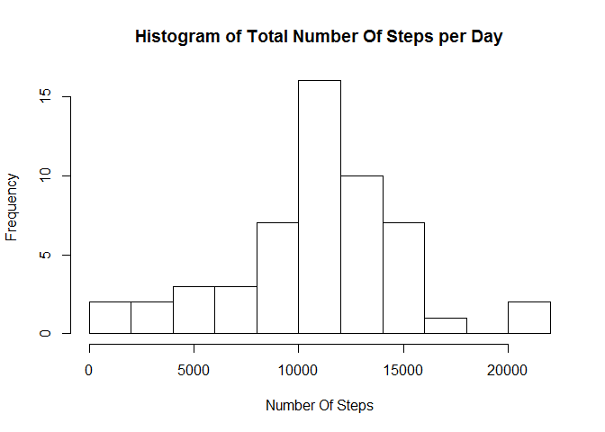
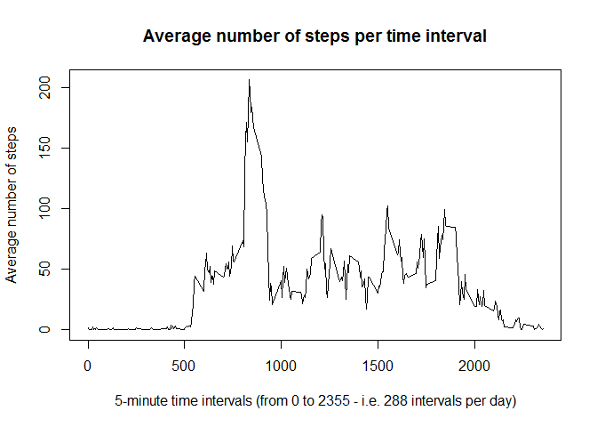
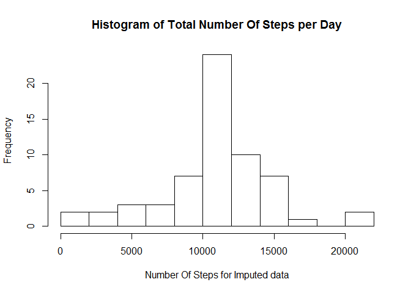
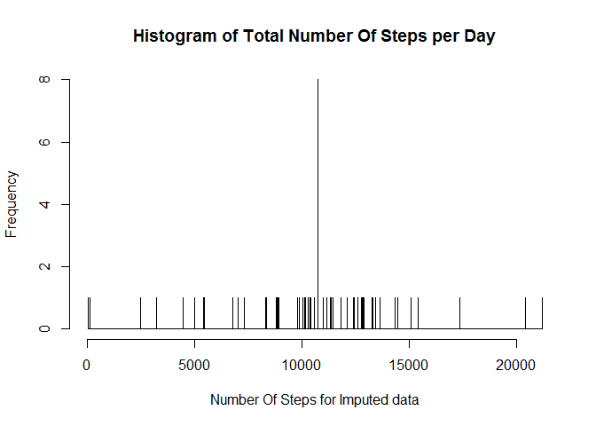
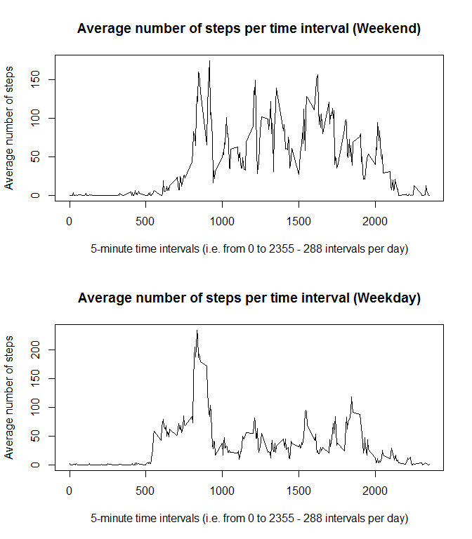

# Reproducible Research: Peer Assessment 1

This assignment makes use of data from a personal activity monitoring device. This device collects data at 5 minute intervals
through out the day. The data consists of two months of data from an anonymous individual collected during the months of
October and November, 2012 and include the number of steps taken in 5 minute intervals each day.

The data for this assignment was downloaded from https://d396qusza40orc.cloudfront.net/repdata%2Fdata%2Factivity.zip

The variables included in the dataset are:

- steps: Number of steps taking in a 5-minute interval (missing values are coded as NA)
- date: The date on which the measurement was taken in YYYYMMDD format
- interval: Identifier for the 5-minute interval in which measurement was taken

The dataset is stored in a comma-separated-value (CSV) file and there are a total of 17,568 observations in the dataset.

## Obtaining the data

We download and unzip the data, if it hasn't been done previously. Thus, we check if the file 'activity.csv' exists:

```r
if (!file.exists("activity.csv")){
fileUrl <- "https://d396qusza40orc.cloudfront.net/repdata%2Fdata%2Factivity.zip"
fileDownloadDest <- "activity.zip"
download.file(fileUrl, fileDownloadDest, method = "curl")
unzip(fileDownloadDest)
}
```

## Loading and preprocessing the data

The data in 'activity.csv' obtained above is read and stored in the dataframe df_orig.

```r
df_orig <- read.csv("activity.csv", na.strings = "NA", header = TRUE)
```

We make sure that date is of type Date

```r
df_orig$date <- as.Date(df_orig$date)
```

The data in df_orig looks like the following

```r
dim(df_orig)
```

```
## [1] 17568     3
```

```r
head(df_orig)
```

```
##   steps       date interval
## 1    NA 2012-10-01        0
## 2    NA 2012-10-01        5
## 3    NA 2012-10-01       10
## 4    NA 2012-10-01       15
## 5    NA 2012-10-01       20
## 6    NA 2012-10-01       25
```


## What is mean total number of steps taken per day?

For now, let us create a dataframe 'df_clean' without missing values and operate on that:

```r
df_clean <- df_orig[(!is.na(df_orig$steps)) & (!is.na(df_orig$date)) & (!is.na(df_orig$interval)),]
```

We use 'aggregate' to calculate the total number of steps per day. After that we add labels to the colums.

```r
totalStepsPerDay <- aggregate(df_clean$steps, list(df_clean$date), sum)
colnames(totalStepsPerDay) <- c('Date','NumberOfSteps')
head(totalStepsPerDay)
```

```
##         Date NumberOfSteps
## 1 2012-10-02           126
## 2 2012-10-03         11352
## 3 2012-10-04         12116
## 4 2012-10-05         13294
## 5 2012-10-06         15420
## 6 2012-10-07         11015
```

A histogram of the total number of steps taken each day:

```r
with(totalStepsPerDay,hist(NumberOfSteps, main = "Histogram of Total Number Of Steps per Day", 
                           xlab = "Number Of Steps", breaks = 10))
```

<!-- -->

We can compute the mean and median of the total number of steps taken each day.

```r
meanClean <- mean(totalStepsPerDay$NumberOfSteps)
medianClean <- median(totalStepsPerDay$NumberOfSteps)
```
The values are

```r
meanClean
```

```
## [1] 10766.19
```

```r
medianClean
```

```
## [1] 10765
```


## What is the average daily activity pattern?

We use 'aggregate' to calculate the the average number of steps taken per 5-minute interval. After that we add labels to the colums.

```r
avgStepsPerInterval <- aggregate(df_clean$steps, list(df_clean$interval), mean)
colnames(avgStepsPerInterval) <- c('interval','averageNumberOfSteps')
```

A time series plot of the 5-minute and the average number of steps taken, averaged across all days:

```r
with(avgStepsPerInterval, plot(interval, averageNumberOfSteps, type = 'l',
     xlab = "5-minute time intervals (from 0 to 2355 - i.e. 288 intervals per day)", 
     ylab = "Average number of steps",
     main = "Average number of steps per time interval")
)
```

<!-- -->

To determine which 5-minute interval, on average across all the days in the dataset, contains the maximum number of steps, we first find the index with the maximum number of steps (maxIndex) from the dataset avgStepsPerInterval. After that we pick the interval at that index (maxInterval):

```r
maxIndex <- which.max(avgStepsPerInterval$averageNumberOfSteps)
maxInterval <- avgStepsPerInterval$interval[maxIndex]
maxInterval
```

```
## [1] 835
```
Thus the maximum is at the interval 835 (i.e. time 08:35).

## Imputing missing values

There is no NA's in the 'intervals' or 'dates', as can be seen below:

```r
sum(is.na(df_orig$interval))
```

```
## [1] 0
```

```r
sum(is.na(df_orig$date))
```

```
## [1] 0
```

The NA's are only in the column containing the number of steps:

```r
sum(is.na(df_orig$steps))
```

```
## [1] 2304
```
Thus, the total number of missing values in the dataset (i.e. the total number of rows with NA's) is 2304.

As sugested, a strategy for filling in all of the missing values in the dataset could be to use the mean for that 5-minute interval.

To do it like that, we first merge the original data with the averages data per interval

```r
df_merge <- merge(df_orig, avgStepsPerInterval)
```

Let us update the column 'steps', where we put the number of steps, if it exists in the orignal data.
Otherwise we put the average number of steps for that interval. 

Thus, we do the following:

```r
df_merge$steps <- ifelse(is.na(df_merge$steps), df_merge$averageNumberOfSteps, df_merge$steps)
```
By this, we have

```r
head(df_merge)
```

```
##   interval    steps       date averageNumberOfSteps
## 1        0 1.716981 2012-10-01             1.716981
## 2        0 0.000000 2012-11-23             1.716981
## 3        0 0.000000 2012-10-28             1.716981
## 4        0 0.000000 2012-11-06             1.716981
## 5        0 0.000000 2012-11-24             1.716981
## 6        0 0.000000 2012-11-15             1.716981
```

```r
tail(df_merge)
```

```
##       interval    steps       date averageNumberOfSteps
## 17563     2355 0.000000 2012-10-16             1.075472
## 17564     2355 0.000000 2012-10-07             1.075472
## 17565     2355 0.000000 2012-10-25             1.075472
## 17566     2355 0.000000 2012-11-03             1.075472
## 17567     2355 1.075472 2012-10-08             1.075472
## 17568     2355 1.075472 2012-11-30             1.075472
```

Let us sort the data by date and interval

```r
library(plyr)
df_merge <- arrange(df_merge, date, interval)
```
Now, let us define a dataset 'df_impute', equal to the original dataset (df_orig) but with the missing data filled in by selecting the columns needed from 'df_merge' to match the layout of the original data in 'df_orig':

```r
df_impute <- df_merge[,c("steps", "date", "interval")]
```
Let us compare the original data with the new imputed data:

```r
head(df_orig)
```

```
##   steps       date interval
## 1    NA 2012-10-01        0
## 2    NA 2012-10-01        5
## 3    NA 2012-10-01       10
## 4    NA 2012-10-01       15
## 5    NA 2012-10-01       20
## 6    NA 2012-10-01       25
```

```r
head(df_impute)
```

```
##       steps       date interval
## 1 1.7169811 2012-10-01        0
## 2 0.3396226 2012-10-01        5
## 3 0.1320755 2012-10-01       10
## 4 0.1509434 2012-10-01       15
## 5 0.0754717 2012-10-01       20
## 6 2.0943396 2012-10-01       25
```

Now, we again use 'aggregate' to calculate the total number of steps per day. After that we add labels to the colums.

```r
totalStepsPerDayImpute <- aggregate(df_impute$steps, list(df_impute$date), sum)
colnames(totalStepsPerDayImpute) <- c('Date','NumberOfSteps')
```

A histogram of the total number of steps taken each day

```r
with(totalStepsPerDayImpute, hist(NumberOfSteps, 
                                  main = "Histogram of Total Number Of Steps per Day", 
                                  xlab = "Number Of Steps for Imputed data", breaks = 10))
```

<!-- -->

After that we compute the mean and median.

```r
meanImpute <- mean(totalStepsPerDayImpute$NumberOfSteps)
medianImpute <- median(totalStepsPerDayImpute$NumberOfSteps)
```
The values are

```r
meanImpute
```

```
## [1] 10766.19
```

```r
medianImpute
```

```
## [1] 10766.19
```
When using the method above for imputing data, the mean is unchanged and we change the median slightly from the case with clean data without missing value, since we had

```r
meanClean
```

```
## [1] 10766.19
```

```r
medianClean
```

```
## [1] 10765
```
We also see, that now (for imputed data) the mean and median are identical. 

To better understand why, we can take a closer look at the data - e.g. by using a histogram with many breaks, say 5000:

```r
with(totalStepsPerDayImpute, hist(NumberOfSteps, 
                                  main = "Histogram of Total Number Of Steps per Day", 
                                  xlab = "Number Of Steps for Imputed data", breaks = 5000))
```

<!-- -->

In the original data we had 8 days of missing data. All of those were assigned the value of 'meanClean' = 10766.19. In all the other bins there is at most one observation.

Since there are 8 values identical to 'meanClean' (including the 50 percent quantile), the values of the mean and median are identical.


## Are there differences in activity patterns between weekdays and weekends?

We split the data using the method 'weekdays' applied to the 'dates' in the clean data set (df_clean) to avoid averaging effects in the imputed data.

We start by finding the weekday, called 'wkd', and the determine if it is in the weekend or weekday - that is the new factor variable 'facvar' with two levels:

```r
wkd <- weekdays(df_clean$date)
df_clean$facvar <- ifelse(wkd == "Saturday" | wkd == "Sunday", "weekend", "weekday")
```

The reulting two datasets are then:

```r
df_weekend <- subset(df_clean, facvar == "weekend")
df_weekday <- subset(df_clean, facvar == "weekday")
```

As before, we use 'aggregate' to calculate the the average number of steps taken per 5-minute interval for each dataset. After that we add labels to the colums for each dataset.

```r
avgStepsPerIntervalWeekend <- aggregate(df_weekend$steps, list(df_weekend$interval), mean)
colnames(avgStepsPerIntervalWeekend) <- c('interval','averageNumberOfSteps')
```


```r
avgStepsPerIntervalWeekday <- aggregate(df_weekday$steps, list(df_weekday$interval), mean)
colnames(avgStepsPerIntervalWeekday) <- c('interval','averageNumberOfSteps')
```

Let us display the two base plots by setting the mfrow:

```r
par(mfrow = c(2,1))
with(avgStepsPerIntervalWeekend, plot(interval, averageNumberOfSteps, type = 'l',
     xlab = "5-minute time intervals (i.e. from 0 to 2355 - 288 intervals per day)", 
     ylab = "Average number of steps",
     main = "Average number of steps per time interval (Weekend)")
)
with(avgStepsPerIntervalWeekday, plot(interval, averageNumberOfSteps, type = 'l',
     xlab = "5-minute time intervals (i.e. from 0 to 2355 - 288 intervals per day)", 
     ylab = "Average number of steps",
     main = "Average number of steps per time interval (Weekday)")
)
```

<!-- -->

By inspection we see there are differences in activity patterns between weekdays and weekends. 

During weekends the activity seems to be
more constant and at a somewhat higher level during the day. During weekdays we see a clear spike in the morning - perhaps when going to
work or school.

